# AnonHire System Workflow Diagram

## Complete System Architecture & User Flows

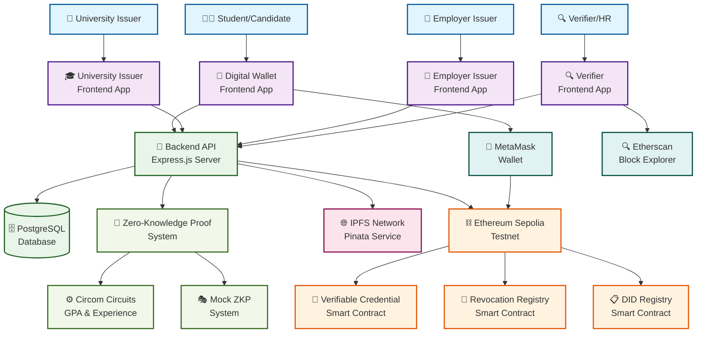

## Detailed User Workflows

### 1. Credential Issuance Flow

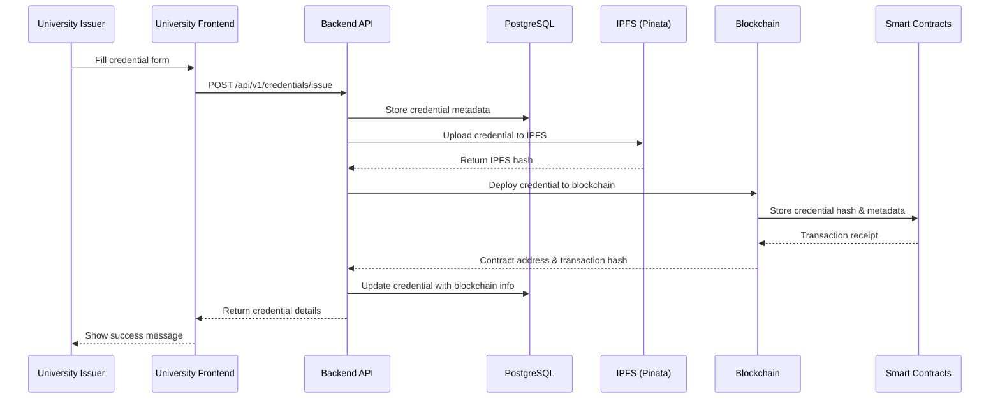

### 2. Credential Viewing & Management Flow

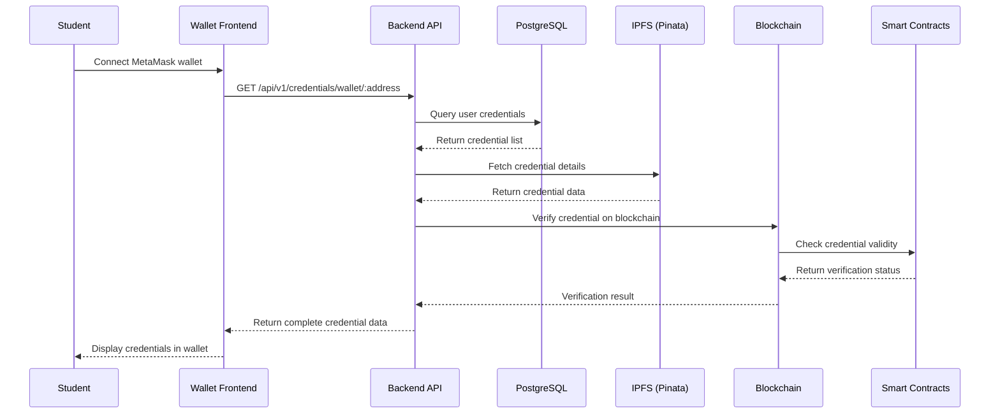

### 3. Zero-Knowledge Proof Generation Flow

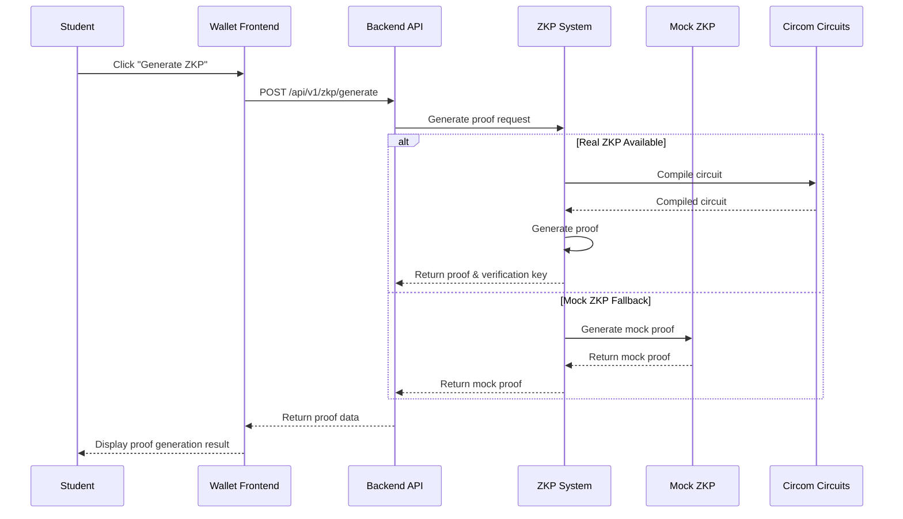

### 4. Credential Verification Flow

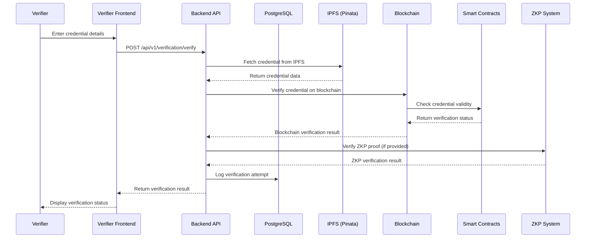

## System Architecture Overview

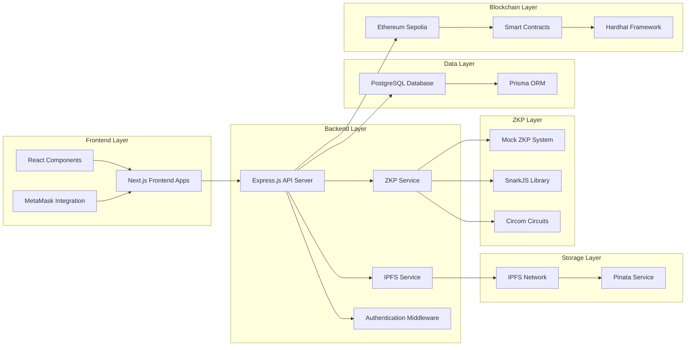

## Deployment Workflow

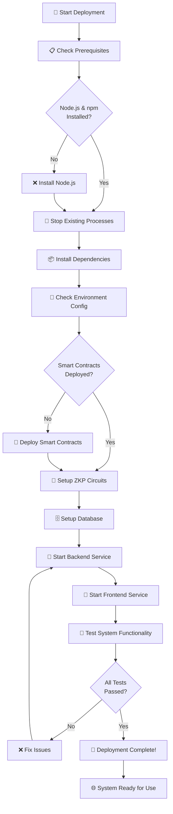

## Technology Stack Overview

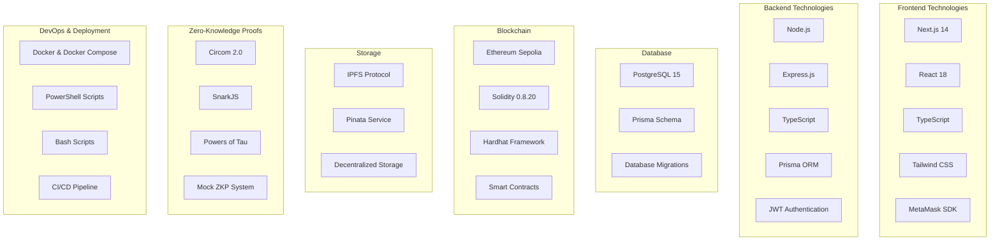

## Key Features & Capabilities

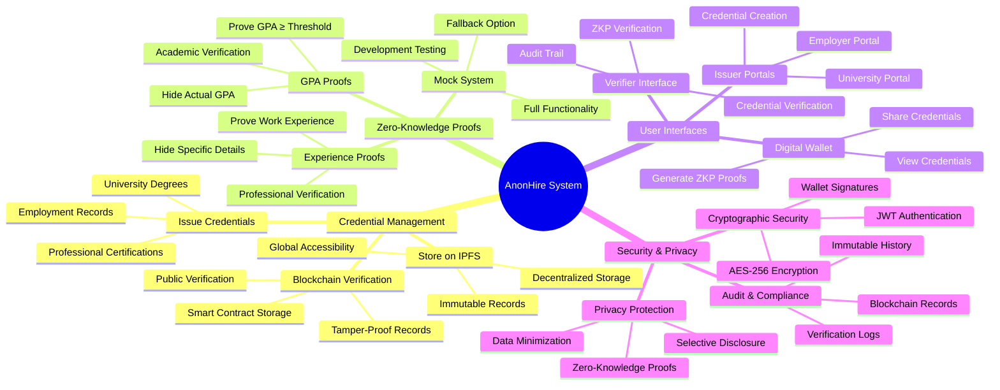

### 5. DID Creation & Registration Flow

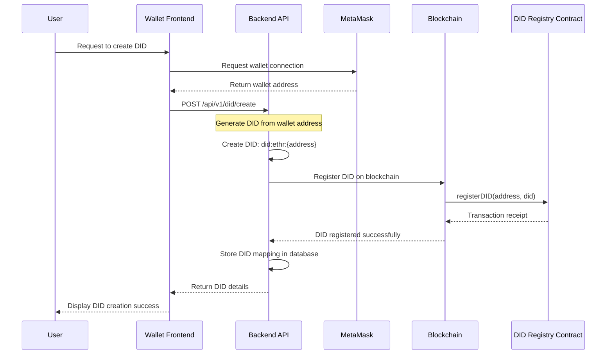

### 6. Credential Revocation Flow

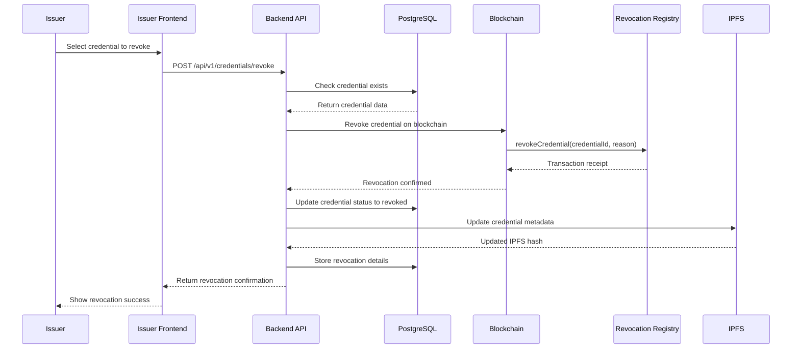

## Algorithm & Decision Flowcharts

### 1. ZKP Proof Verification Algorithm

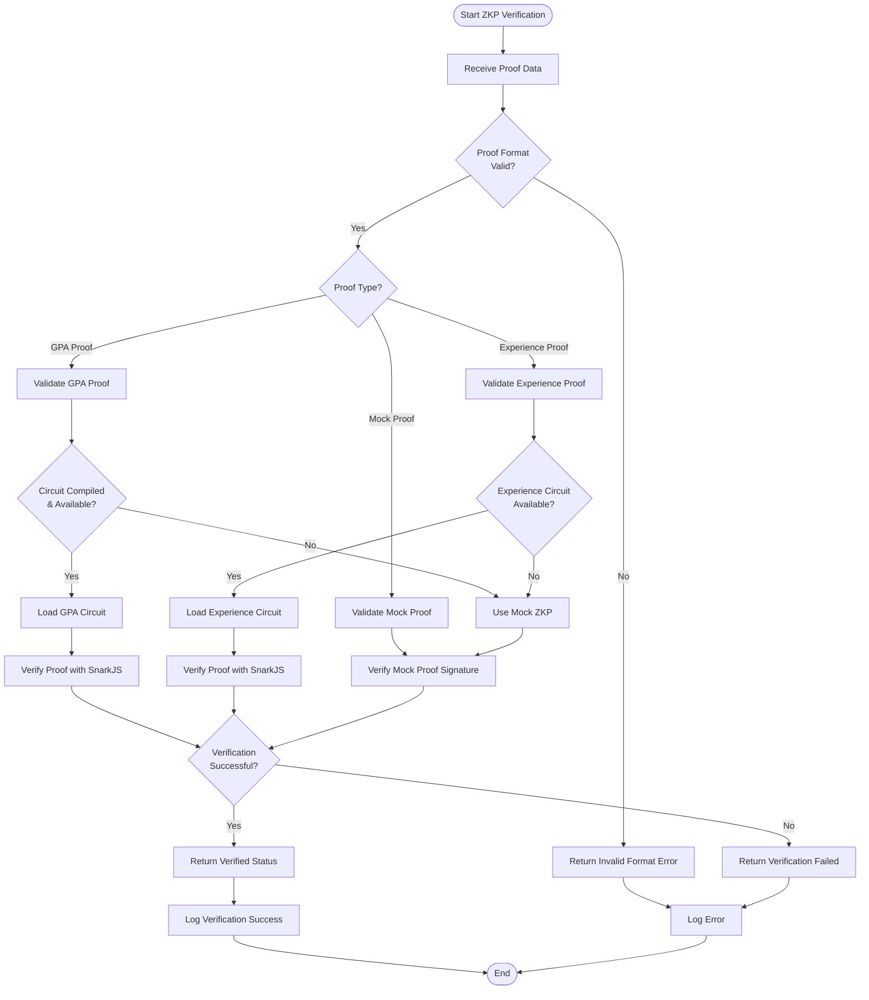

### 2. Credential Verification Decision Flow

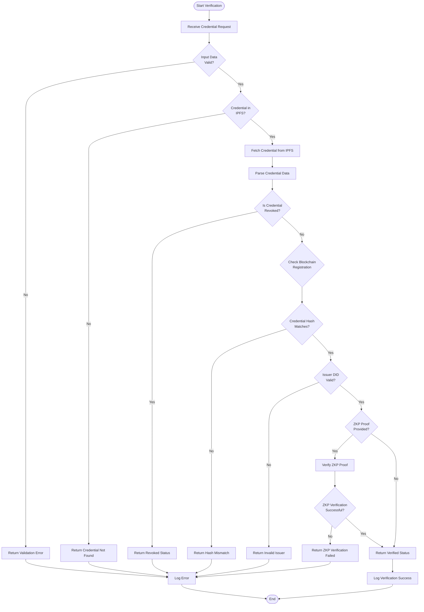

### 3. Credential Lifecycle Flowchart

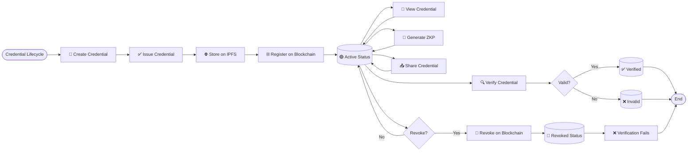

### 4. Authentication & Authorization Flow

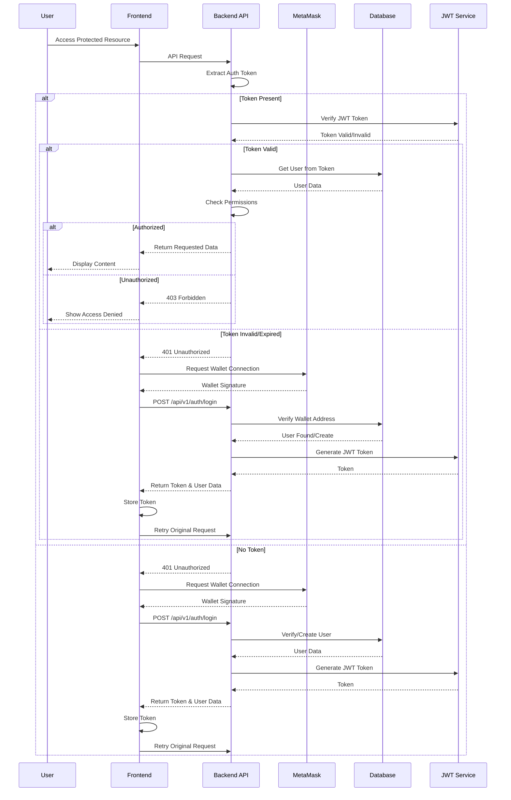

### 5. Smart Contract Interaction Flow

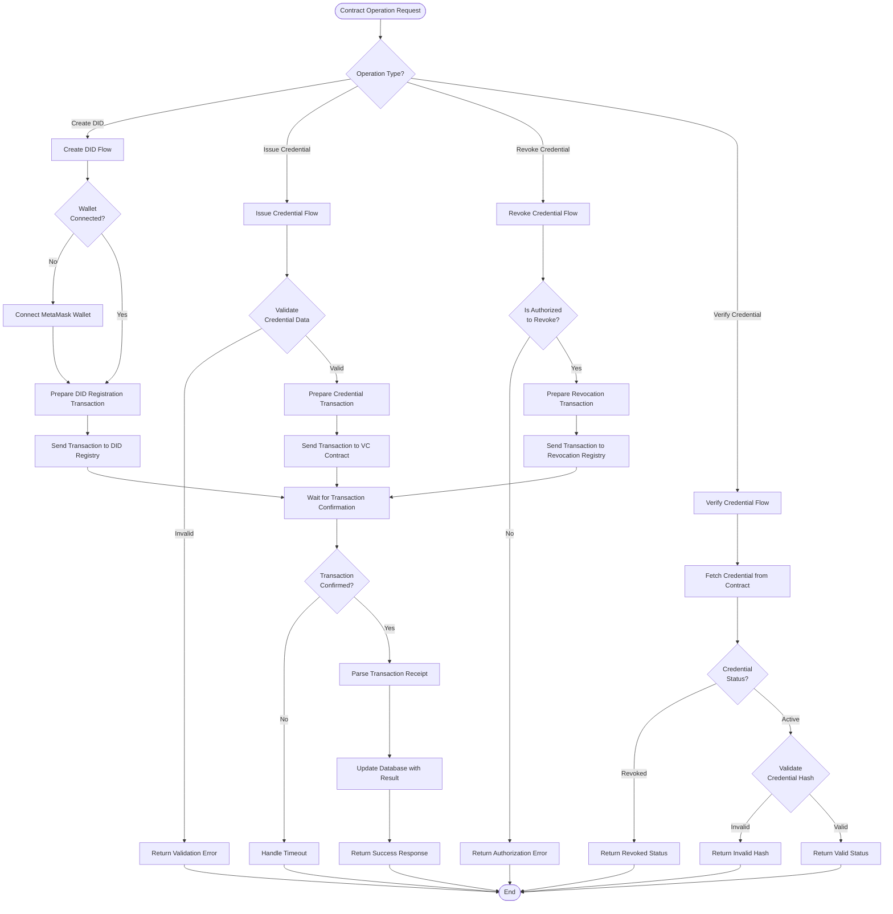

### 6. IPFS Upload & Retrieval Algorithm

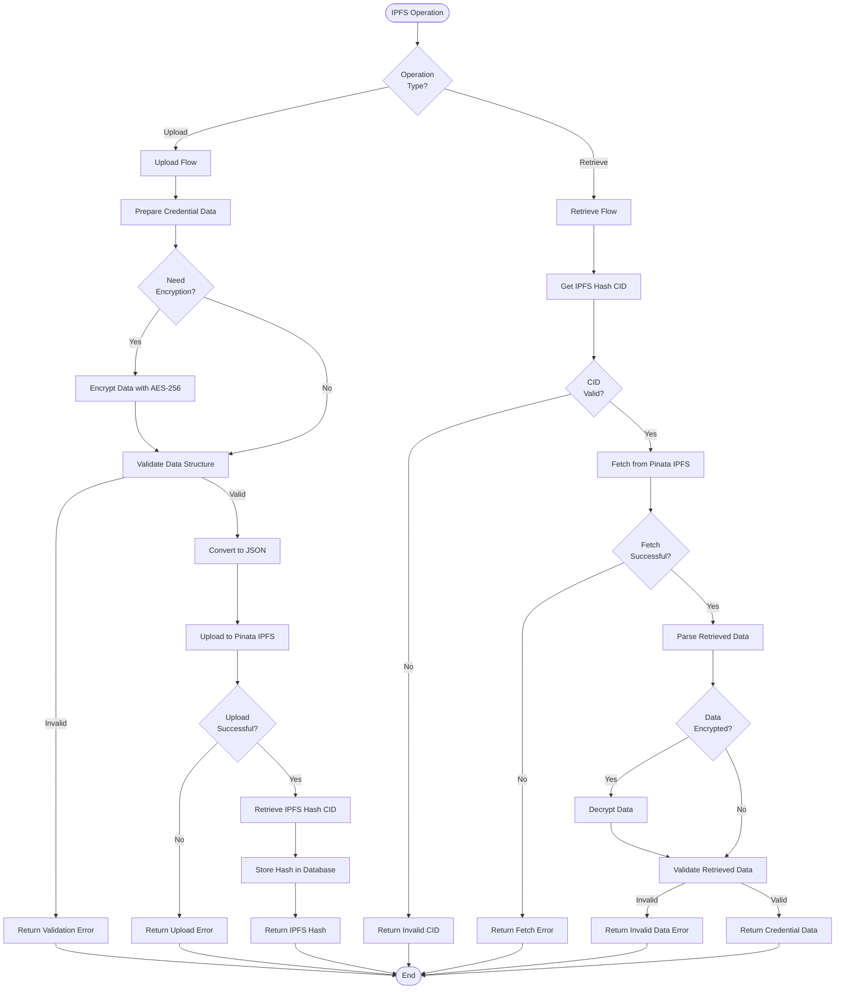

This comprehensive workflow diagram shows the complete AnonHire system architecture, user flows, and technology stack. The system provides a full-featured credential verification platform with blockchain integration, IPFS storage, and zero-knowledge proof capabilities.
